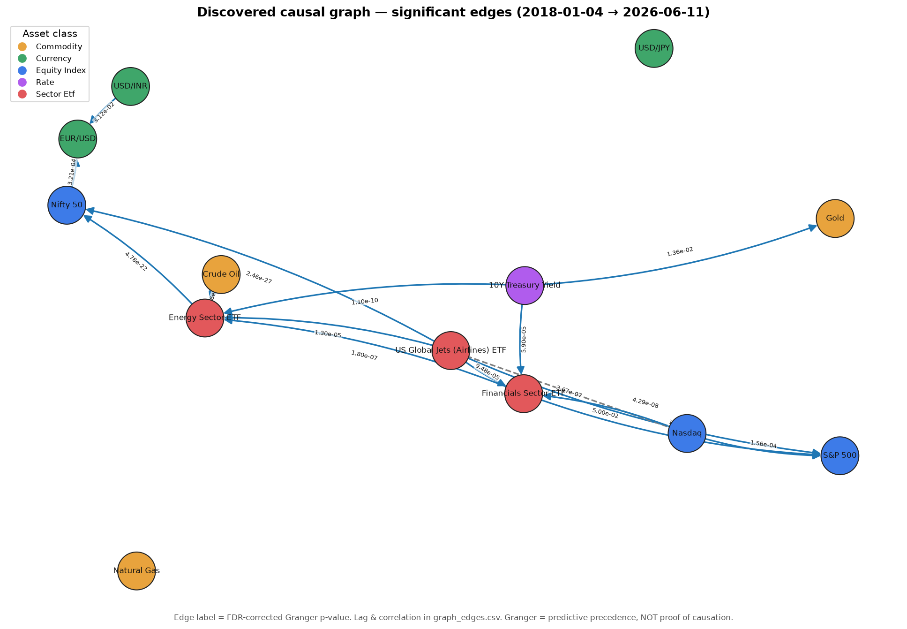
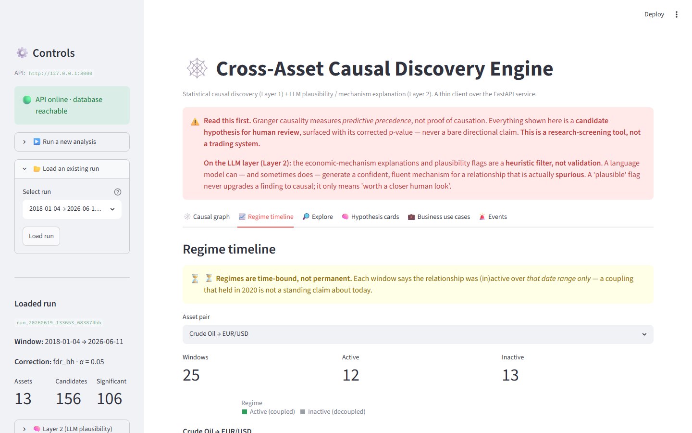

# Cross-Asset Causal Discovery Engine

A hybrid **statistical + local-LLM** system that surfaces *candidate* causal
relationships across a fixed cross-asset universe — commodities, currencies,
equity indices, rates and sector ETFs. The statistical engine (Layer 1) detects
candidate causal structure and reports **every edge with the corrected p-value
that justifies it**; a local LLM (Layer 2) then *explains* the economic
mechanism and rates its plausibility — **a heuristic filter, never validation.**
The output is **causal hypothesis *cards for human review*, never bare
directional claims and never a trading signal.**

Runs entirely offline — no cloud APIs, no per-token cost, no data leaving the
machine (Layer 2 uses a local Ollama model).

> **Status: Layers 1 & 2 complete.** Statistical engine + local-LLM plausibility
> layer + REST API + SQLite persistence + Streamlit dashboard are built, tested
> (**62 tests green**) and verified end-to-end against a recorded 8-year run
> (see [`results/`](results/)). Layer 2 ran over all **106** surviving candidates
> with `llama3.1:8b-instruct-q4_0`; the honest flag distribution and the
> spurious-rationalization control result are in
> [`results/cards_summary.md`](results/cards_summary.md) and the
> [Layer 2 section](#layer-2--llm-plausibility--explanation-built) below.

---

## ⚠️ Critical Framing — Read This First

**This system does not discover "true causality."** That framing is prominent
here by design, not buried — stating the limits up front is the point of the
project.

- **Granger causality is predictive precedence, not proof of causation.** It
  says asset A's *past* helps predict asset B's *future* beyond B's own past —
  nothing more. A lurking common driver produces the same signal.
- Every output is a **candidate causal hypothesis for human review.** Nothing
  here asserts proven causation; the type system itself hedges
  (`CausalCandidate`, `statistical_confidence`).
- The Layer 2 LLM plausibility check is a **heuristic triage aid, not
  validation** — an LLM can rationalize a spurious finding convincingly. This is
  the named, designed-for risk of the layer; it is **tested** with a deliberate
  spurious-control probe (see [Layer 2](#layer-2--llm-plausibility--explanation-built)),
  not hoped away. The LLM never upgrades a finding to "causal" and every card it
  produces still carries the corrected statistic it explains.
- **This is a research-screening tool, not a trading system,** and must never
  be framed or used as one.

No view in the dashboard, no row in the API, and no figure in this README
presents a causal arrow without the statistic behind it.

---

## What the Recorded Run Found

A single reproducible run over **2018-01-03 → 2026-06-12** (covered window after
alignment: **2018-01-04 → 2026-06-11**, ~1,820 aligned daily cross-sections),
FDR–Benjamini-Hochberg correction at α = 0.05, max lag 5 trading days. Full
artifacts in [`results/`](results/); summary in
[`results/run_summary.md`](results/run_summary.md).

| Metric | Value |
|---|---|
| Assets analysed | **13** (all tickers returned data; none failed) |
| Candidate relationships (ordered pairs) | **156** |
| Significant after FDR correction | **106** |
| Edges kept by PC graph | **20** (16 of them Granger-significant) |
| Regime windows detected | **2,143** across 106 pairs |
| Layer-2 hypothesis cards | **106** (3 known-mechanism · 5 novel · 98 likely-spurious · 0 mismatch · 0 parse-failed, after mechanism-hallucination fix) |
| Test suite | **62 passed** ([`results/test_output.txt`](results/test_output.txt)) |



*Discovered causal graph — the 16 significant edges, each labelled with its
FDR-corrected Granger p-value. Lag and correlation for every edge are in
[`results/graph_edges.csv`](results/graph_edges.csv).*

**Top graph edges (most significant):**

| Driver → Affected | Corrected p | Lag | Corr | type/orientation |
|---|---|---|---|---|
| Airlines ETF → Nifty 50 | 2.46e-27 | 4 | −0.047 | directed / pc |
| Energy ETF → Nifty 50 | 4.78e-22 | 5 | +0.118 | directed / pc |
| 10Y Yield → Energy ETF | 1.10e-10 | 5 | +0.132 | directed / pc |
| Airlines ETF → S&P 500 | 4.29e-08 | 2 | +0.167 | directed / pc |
| Financials ETF → Energy ETF | 1.80e-07 | 2 | +0.151 | directed / pc |

---

## Did the Strong Results Survive Scrutiny? (Stationarity Stress-Test)

The single strongest *candidate* was **10Y Treasury Yield → USD/JPY** at a
corrected p of **7.09e-46** (lag 1, corr +0.33). An extreme p-value over an
8-year daily window can be a real lead-lag **or** an artifact of non-stationary,
autocorrelated inputs that the multiple-comparisons correction doesn't fully
absorb. So before trusting it, every log-return series feeding the Granger stage
was run through an **Augmented Dickey-Fuller** test
([`results/stationarity.csv`](results/stationarity.csv)).

**Finding — the results survive.** All **13 / 13** return series are stationary
at the 5% ADF level (every ADF p < 0.05). The *least*-stationary series is the
10Y yield itself (`^TNX`, ADF p = 1.27e-12, statistic −8.10 vs the 1% critical
value −3.43) — and it still rejects the unit-root null decisively. So the
extreme Granger p-values are **not** an artifact of non-stationary inputs.

Two honesty notes recorded rather than hidden:

- **The strongest candidate was *rejected by the graph layer.*** `^TNX → JPY=X`
  is the most significant single test, but PC set `in_graph = false` — its
  conditional-independence test explained the link away via another path. The
  discovery layer is appropriately skeptical even of the headline number.
- Stationarity removes *one* artifact explanation. It does not remove the
  others — see [Known Limitations](#known-limitations-stated-by-design).

---

## Do the Edges Hold Out-of-Sample? (Walk-Forward Replication)

The stationarity test rules out one artifact (non-stationary inputs). It does
**not** answer the bigger question: is "156 candidates, ~103 significant" a
durable finding, or partly in-sample overfitting across 156 simultaneous tests?
This is the statistical analog of the Layer-2 spurious-rationalization control,
applied to Layer 1 — and the result is reported here exactly as it came out,
favourable or not.

**Method ([`scripts/run_replication_study.py`](scripts/run_replication_study.py),
[`results/replication_summary.md`](results/replication_summary.md)).** A single
train/test split — *not* rolling walk-forward. A single split answers the core
falsifiable question (do discovery edges replicate in an untouched holdout?) with
one interpretable number per category at two pipeline passes instead of N; PC
discovery is combinatorial, and full walk-forward's marginal rigour doesn't
justify the cost for a portfolio project whose standard is clarity over maximal
rigour. The full Layer-1 pipeline (Granger → FDR → PC → HMM) was run independently
on each window:

| Window | Covered | Aligned rows | Significant edges |
|---|---|---|---|
| **Discovery** | 2018-01-05 → 2023-12-29 | 1301 | 103 / 156 |
| **Holdout** | 2024-01-03 → 2026-06-11 | 520 | 16 / 156 |

The split point (end-2023) gives discovery the full 2020 COVID regime break so
its edge set is as strong as possible — making replication the cleanest possible
challenge to *those* edges — while leaving a 2.4-year holdout (~10× the 50-row
floor) in a structurally different post-COVID / higher-rate regime. A pair counts
as **replicated** only if the same *ordered* pair (same direction) is
significant-after-correction in **both** windows.

### The headline number is weak — and that's the finding

> **Of 103 discovery-significant edges, 13 replicated in the holdout. Overall
> out-of-sample replication rate: 12.6%. Empirical non-replication rate: 87.4%,
> far above the nominal α = 0.05.**

This is not softened. The majority of edges that pass significance + FDR
correction on the 2018–2023 window do **not** independently clear the same bar on
2024–2026 data. Anyone reading "103 significant relationships" as "103 durable
relationships" would be wrong, and the engine's own out-of-sample test says so.

**PC-graph vs Granger-only (the Phase-1 hypothesis).** Phase 1 predicted PC-kept
edges — which survived conditional-independence pruning of confounded/indirect
links — should replicate more reliably. Result: PC edges 14.3% (2 of 14) vs
Granger-only 12.4% (11 of 89). **The sample is too small to support any
directional claim.** With only **14** PC edges, a single edge flipping in or out
moves the PC rate by ~7 points — enough to erase or reverse the 1.9-point gap
entirely. This comparison therefore neither confirms nor refutes the hypothesis;
it is **inconclusive, full stop.** It is not reported as weak support, a trend
toward confirmation, or a result "consistent with" the prediction — at n = 14 the
data cannot carry any of those readings.

### What the 87.4% does and does not mean

Non-replication is **not** a pure false-discovery rate, and isn't claimed as one.
An edge can fail to replicate for three distinct reasons — only the first is "the
discovery finding was spurious":

1. **In-sample false positive** — overfitting across 156 simultaneous tests.
2. **Real regime change** — a relationship that genuinely held in 2018–2023 and
   genuinely stopped in the different 2024–2026 regime. The whole regime-detection
   layer exists *because* these relationships are not permanent.
3. **Power loss** — 520 holdout rows vs 1301; a real but moderate edge can miss
   the corrected threshold on fewer observations.

Two diagnostics locate where the fragility lives, without explaining it away:

- **Durability tracks signal strength.** Ranking the 103 significant edges by
  discovery p-value, replication is concentrated entirely at the top:

  | Discovery rank band | Replicated | Rate |
  |---|---|---|
  | 1–20 (strongest) | 10/20 | 50.0% |
  | 21–40 | 0/20 | 0.0% |
  | 41–60 | 0/20 | 0.0% |
  | 61+ (weakest) | 3/43 | 7.0% |

  The durable core is the macro backbone — **S&P 500 → Nifty 50** (disc 4.14e-37,
  hold 1.47e-04), **10Y Yield → USD/JPY** (disc 1.20e-35, hold 3.24e-25),
  **Gold → USD/JPY**, **Nasdaq → Nifty 50**, **Financials → Nifty 50**. The broad
  middle of the significant set is fragile out-of-sample. So 12.6% is *not* "the
  method finds nothing durable" — it is "**only the strongest signals are
  durable**, and the long tail of marginally-significant edges is where the
  in-sample fragility concentrates."
- **Reverse coverage.** The holdout surfaced only 16 significant edges total (vs
  103), and **13 of those 16 (81%)** were also in the discovery set. The low
  *forward* rate is driven heavily by the holdout detecting far fewer edges at all
  (power + regime change); the durable edges it does detect are overwhelmingly a
  subset of discovery. This is mechanism, not mitigation — the headline forward
  rate stands at **12.6%**.

**The honest takeaway.** This is the single most important result in the project,
and it validates the framing the whole thing is built on: these are **candidate
hypotheses for human review, not durable causal claims.** The screening layer
casts a wide net; out-of-sample testing shows that net's reliable catch is a small
core of the strongest macro relationships, not the full significant list. A
reviewer should weight a top-decile edge that also passed Layer 2 very differently
from a middle-of-the-pack "significant" one — and now there is a number that says
why. *(Future extension: rolling walk-forward with refitting at each step would
turn this single number into a stability distribution per edge.)*

### Do the durable edges look plausible to the LLM? (Layer 1 ↔ Layer 2)

This cross-check connects the project's **two most rigorous findings** — the
out-of-sample replication study above (Layer 1) and the hardened LLM plausibility
layer (Layer 2). The natural expectation is that the statistically *durable* edges
would also be the ones the LLM independently rated economically plausible. They
are **not** — and the disagreement is reported here exactly as it came out,
because surfacing this kind of cross-layer tension is what the two-layer design is
*for*.

Four edges form the durable macro-core (the top-20 band that replicates 50%
out-of-sample): **S&P 500 → Nifty 50**, **10Y Yield → USD/JPY**,
**Gold → USD/JPY**, **Nasdaq → Nifty 50**. Pulling each one's actual Layer-2
hypothesis card from `run_20260619_133653_683874bb`:

| Durable edge | Disc. p (replicated OOS) | PC direct edge? | Layer-2 flag | LLM conf. | Named channel | Bucket |
|---|---|---|---|---|---|---|
| S&P 500 → Nifty 50 | 3.43e-42 | **No** (`in_graph=false`) | `LIKELY_SPURIOUS` | 0.80 | none (null) | 98-spurious |
| 10Y Yield → USD/JPY | 7.09e-46 | **No** | `LIKELY_SPURIOUS` | 0.70 | none (null) | 98-spurious |
| Gold → USD/JPY | 7.28e-29 | **No** | `LIKELY_SPURIOUS` | 0.70 | none (null) | 98-spurious |
| Nasdaq → Nifty 50 | 6.36e-35 | **No** | `LIKELY_SPURIOUS` | 0.60 | none (null) | 98-spurious |

**All four landed in the 98-card `LIKELY_SPURIOUS` bucket — none in the 3
known-mechanism or 5 novel buckets, and none carries a named mechanism channel.**
The mechanism explanations are near-identical: every card attributes the edge to a
**common driver — "global risk sentiment"** — moving both endpoints together
rather than one driving the other (S&P → Nifty "global risk sentiment, which tends
to move both indices in tandem"; 10Y → JPY and Gold → JPY both route through
"global risk sentiment / safe-haven" flows; Nasdaq → Nifty through "global risk
sentiment … Indian market sentiment").

**The honest read — the two layers disagree, and the disagreement is coherent.**
On these four edges Layer 1 says *most durable* while Layer 2 says *likely
spurious, no clean mechanism.* That is a real tension, not a reporting artifact,
and it is **not** resolved here by declaring one layer correct. But the
disagreement is not random noise, because the two layers are scoring **different
axes**:

- **Replication** asks: *does the predictive precedence persist out-of-sample?*
  For these four, yes — they are the most reproducible signals in the set.
- **LLM plausibility** asks: *is there a* direct *economic mechanism, or a
  common-driver confound?* For these four, the model says confound.

A relationship driven by a **persistent common factor** — global equity beta, the
risk-on/risk-off cycle — would be *both* durable out-of-sample (the confounder
itself is stable, so the precedence keeps reproducing) *and* correctly flagged as
lacking a direct mechanism. Those two readings are not contradictory; they are
exactly what "**real but confounded**" looks like, which is precisely reason #2 in
the non-replication taxonomy above and the common-driver story every one of these
cards tells.

**The PC layer corroborates the LLM, not the replication.** Independently of the
LLM, the PC conditional-independence test set `in_graph=false` on **all four** —
it too rejected them as *direct* edges. So two separate screens (PC and the LLM)
agree these are mediated/confounded, while the replication study adds that the
confounded *precedence* is nonetheless stable. This sharpens the existing "the
model is *too* skeptical of the strongest cross-market signals" caveat in the
[Layer 2 section](#layer-2--llm-plausibility--explanation-built): on the narrower
question of *directness*, the LLM is not an outlier — the graph layer made the
same call. The open question is only whether "no direct mechanism" should read as
fully spurious (the LLM's flag) or as "real but indirect" (a durable, confounded
lead-lag).

**What a reviewer should take from this.** A durable edge is the *best* kind of
candidate to act on for **timing** (S&P 500 still led Nifty 50 across both
windows). It is *not* thereby a validated direct causal channel — both the graph
layer and the LLM say treat its mechanism as an open question. The system delivers
those two judgments side by side instead of collapsing them into one false
"confirmed," which is the entire point of keeping a statistical layer and a
plausibility layer that are allowed to disagree.

---

## Layer 2 — LLM Plausibility & Explanation (built)

Layer 2 takes the candidates that **already passed** significance + FDR
correction and asks a **local** model (`llama3.1:8b-instruct-q4_0` via Ollama)
to do one job: *explain* whether a known economic mechanism could link the pair
in this direction at this lag, name the textbook channel if one exists, and —
crucially — judge whether the relationship is more likely **spurious or
confounded**. The output is a `HypothesisCard` (Pydantic-validated) that wraps
the **untouched** statistic with a plausibility flag, a confidence, a named
channel, and explicit caveats.

> **The whole point of this layer — stated in code comments and here.** The
> plausibility check is a **heuristic filter, not validation.** An LLM will
> happily generate a confident, fluent economic mechanism for a statistically
> **spurious** relationship. The layer is designed to *resist* that, not assume
> it away: the prompt forces the model to consider common-driver confounds and
> gives it a sanctioned `LIKELY_SPURIOUS` verdict, the LLM never upgrades a
> finding to "causal", and **every card still carries its corrected p-value.**
> Granger causality is predictive precedence; this flag is one more screen on
> top of it, not a verdict.

### What the real run produced

Layer 2 ran over all **106** surviving candidates of the recorded run
(temperature 0, fixed seed, ~93 min on a local 8B model). Full cards in
[`results/hypothesis_cards.csv`](results/hypothesis_cards.csv); narrative in
[`results/cards_summary.md`](results/cards_summary.md).

| Plausibility flag | Count (after hardening) | Original run |
|---|---|---|
| `PLAUSIBLE_KNOWN_MECHANISM` | **3** | 8 |
| `PLAUSIBLE_NOVEL` | **5** | 2 |
| `LIKELY_SPURIOUS` | **98** | 96 |
| `MECHANISM_MISMATCH` | **0** | (flag did not exist) |
| `PARSE_FAILED` | **0** | 0 |

> The right-hand column is the original run; the left is after the
> mechanism-hallucination fix described in
> [the next section](#mechanism-hallucination--found-diagnosed-fixed). Only the
> 10 previously-"plausible" cards were re-validated under the hardened prompt
> (the 96 already-`LIKELY_SPURIOUS` cards were left untouched), so the table
> mixes provenance — stated plainly rather than re-running 93 minutes to make
> the timestamps match.

**The honest headline: this local model is markedly conservative.** It flagged
**98 of 106** candidates `LIKELY_SPURIOUS`, repeatedly citing a common-driver
confound (global risk sentiment, the dollar, rates) or the relationship's
episodic regime history. It reserves `PLAUSIBLE_KNOWN_MECHANISM` for the
clearest textbook channels — oil/energy transmissions, e.g. **Crude Oil →
Energy ETF** ("Crude Oil → production costs for energy companies → Energy Sector
ETF", p = 1.26e-05) and **Energy ETF → Airlines ETF** ("Energy Sector ETF →
fuel prices → US Global Jets (Airlines) ETF").

This conservatism is the **desired direction of bias** for a filter meant to
resist rationalizing noise — but it is recorded here honestly because it almost
certainly **under-credits some real channels.** The clearest example: the model
flagged **S&P 500 → Nifty 50** (corrected p = 3.43e-42) `LIKELY_SPURIOUS` with
confidence 0.80, attributing it to "global risk sentiment" — yet a global
equity-beta link from US to Indian equities is about as textbook as it gets.
The model is, if anything, *too* skeptical of the strongest cross-market
signals. That is a prompt-tuning trade-off, surfaced rather than hidden.

### Mechanism hallucination — found, diagnosed, fixed

Review of the first run surfaced a concrete defect, and the project's policy is
to record such things rather than quietly patch them. The candidate **Financials
ETF (XLF) → Crude Oil (CL=F)** was flagged `PLAUSIBLE_NOVEL` with the channel
*"oil price → input costs → airline margins"* — a **real textbook channel for an
entirely different pair** (oil → airlines), pattern-matched onto XLF/CL=F on the
strength of the shared word "oil." Neither endpoint of that channel is
Financials *or* Crude.

**This was systemic, not a one-off glitch.** Re-validating all 10
previously-"plausible" cards under the fix, **8 of the 10 channels changed** and
the memorised *"…→ input costs → airline margins"* phrase turned out to have been
pasted onto **two** pairs (`XLF→CL=F` *and* `^NSEI→XLE`) where airlines are
irrelevant — while the one pair it genuinely fit (`XLE→JETS`, energy → airline
fuel costs) kept it. Several other channels were generic, endpoint-free strings
("input costs", "input cost channel") that never named the pair at all.

**Diagnosis.** The prompt (a) never required the channel to name the candidate's
two actual assets, and (b) literally used *"oil price → input costs → airline
margins"* as the schema's example — so the model copied the example verbatim
whenever the topic felt similar.

**Fix (two layers).**
1. **Prompt** (`llm/prompts.py`): the channel field now binds the candidate's
   two real asset names into the required format `"{asset_a} → … → {asset_b}"`,
   a mandatory self-check tells the model to delete any channel whose endpoints
   are a different pair, and "no clean mechanism for *these two* assets" is now an
   explicitly sanctioned answer (null channel + `LIKELY_SPURIOUS`) instead of an
   implicit push to always name one.
2. **Structural backstop** (`llm/validator.py`): after parsing, the validator
   checks that the named channel references *both* of the candidate's assets
   (token match on names + ticker). On mismatch it retries once with an explicit
   correction; if the model still references the wrong assets, the card is
   re-flagged **`MECHANISM_MISMATCH`** (a validator marker, like `PARSE_FAILED` —
   never an accepted "plausible" verdict) with the bad channel stripped. A
   mismatched-asset explanation can never reach the dashboard labelled clean.

**Corrected outcome.** Under the fix, `XLF→CL=F` now returns **`LIKELY_SPURIOUS`
with `mechanism_channel = null`** — the model declines to invent a channel and
instead reasons about investor-sentiment confounding, exactly the intended
behaviour. A second card, `^IXIC→^GSPC` (Nasdaq → S&P 500), also dropped from
`PLAUSIBLE_NOVEL` to `LIKELY_SPURIOUS`. The net effect on the full run was small
and in the right direction: **spurious 96 → 98**, because the model stopped
manufacturing channels for two pairs it could not honestly explain — not because
anything regressed. The remaining eight plausible cards kept their verdicts but
now carry **pair-specific channels that actually name both endpoints** (e.g.
`Crude Oil → economic activity → Financials Sector ETF`). Final
`MECHANISM_MISMATCH` count: **0** — every channel the run kept genuinely names
its own pair. The regression is locked in by `tests/test_llm_validator.py`
(corrective-retry recovers; persistent hallucination → `MECHANISM_MISMATCH`;
a correct channel passes untouched).

**Not a clean win — the honest accounting.** Re-validating the 10 cards,
**7 changed flag** (full table in
[`results/cards_summary.md`](results/cards_summary.md)). Two are clean
hallucination kills (`XLF→CL=F`, `^NSEI→XLE` both had the borrowed
"airline margins" channel); two declined-to-manufacture into `spurious`
(`XLF→CL=F`, `^IXIC→^GSPC`); three known→novel de-ratings where the old "known"
rested on a generic or wrong channel. But **`XLE→^TNX` is a genuine borderline
over-correction**: energy prices → inflation expectations → long-term rates *is*
a textbook macro channel, and the hardened prompt demoted it known→novel — i.e.
the fix is now slightly *too* conservative on at least one defensible mechanism.
It still surfaces as `plausible_novel` (not buried as `spurious`), but it is
recorded as a trade-off, not hidden. One methodological caveat: because the
**prompt itself** changed (not just the validator backstop), all 10 cards were
fully re-generated, so these flag shifts conflate the targeted mismatch fix with
general re-rating drift and cannot be cleanly separated.

### The spurious-rationalization control (the test that earns the honesty claim)

We fed the validator a **deliberately fabricated** candidate — *USD/INR
"Granger-causes" US Natural Gas*, two economically-unrelated assets with an
**invented** "significant" p-value — through the exact same prompt, to check the
model is not rubber-stamping everything as plausible.

**Result: the model correctly returned `LIKELY_SPURIOUS` (confidence 0.50).** It
offered a thin, half-hearted story ("a stronger rupee could raise gas imports")
but declined to endorse it — exactly the behaviour we want. This is asserted two
ways: a deterministic unit test proves the pipeline *can* surface
`LIKELY_SPURIOUS` (it is not hard-wired to "plausible"), and an Ollama-gated
**live** test (`test_spurious_control_live_is_not_rubber_stamped`) exercises the
real model. *Had the model rationalized the nonsense, that would be documented
here as a finding and a reason to harden the prompt — not hidden.*

### The canonical PC-rejection case: `^TNX → JPY=X`

The headline Phase-1 finding is Granger-strong (corrected p = **7.09e-46**,
lag 1, corr +0.33) yet **`in_graph = false`** — PC's conditional-independence
test rejected it as a *direct* edge. The prompt feeds that tension in and
**requires** the model to reason about it. The card honours that: its
`addresses_pc_rejection` flag is **True**, it is flagged `LIKELY_SPURIOUS`
(confidence 0.70), and its reasoning is *"the strong predictive signal … is
likely mediated through changes in global risk sentiment … not directly captured
by the Granger test"* — i.e. it correctly reads a Granger-strong, PC-rejected
edge as **mediated/confounded, not direct.** Across the run, **90** cards
(every significant candidate that PC left out of the graph) carry
`addresses_pc_rejection = True`.

### Engineering notes (hard rules honoured)

- **All Ollama calls are async** (`ollama.AsyncClient`, `format="json"`).
- **Deterministic** where the client allows: temperature 0, fixed seed.
- **Robust parsing:** stray fences stripped, one retry on malformed output, then
  the card is flagged `PARSE_FAILED` rather than crashing the batch. The real run
  hit **0** parse failures across 106 cards.
- **The statistic is never mutated.** A card stores only the narrative + flag;
  its corrected p-value is JOINed back from `causal_candidates` on read, so the
  card and the statistic can never disagree.
- **Graceful degradation:** if Ollama is unreachable the API returns a clean
  **503**, not a 500 traceback, and the dashboard disables the action with a
  clear message.

---

## Phase 3 — Scheduled Regime-Flip Monitoring (built & validated)

Relationships are time-bound (see use case 4 below), so the engine watches for
the moment a previously-reliable coupling **switches on or off**. One monitor
*cycle* (`scripts/run_monitor.py`) re-runs the full Layer-1 pipeline on fresh
data, persists it as a new run, then diffs each pair's *current* regime status
against the most recent prior run.

**A flip is not trusted on first sight — the same discipline as the stationarity
stress-test.** Just as a lone extreme p-value is not a finding until it survives
ADF, a lone regime flip is not a finding until it survives a **confirmation
window**. Every flip moves through three mutually-exclusive, exhaustive states:

| State | Meaning | Is it the signal? |
|---|---|---|
| `pending` | Detected, but has not yet held across `MONITOR_CONFIRMATION_RUNS` (=3) consecutive runs. Carries `consecutive_confirmations / 3` so "how provisional" is explicit. | **No — provisional.** |
| `confirmed` | Its new status persisted across the full window of independent, later observations. | **Yes — the real signal.** |
| `reverted` | Snapped back (or the pair lost significance) before confirming — rejected as a yfinance data-revision artifact or transient. Never presented as a finding. | **No — rejected.** |

Because the states are exhaustive, "genuinely confirmed" is never conflated with
"just hasn't reverted *yet*": a flip that has simply not been observed enough
times is `pending`, not `confirmed`. A reverted flip that later re-flips the same
way is recorded as a **fresh** event, not a revival of the old one.

### Three named safeguards

The monitor is built around three specific failure modes, each guarded by name:

1. **Label-switching safety** (`causal/regime_detection.py`). A 2-state HMM
   numbers its states arbitrarily, and it re-numbers them freely between
   independent fits. If "active" were tied to a raw state index, two consecutive
   runs could disagree on a pair's regime purely from re-labelling and
   manufacture a phantom flip. Instead, **"active" is always the state with the
   higher mean |correlation|** (`argmax(|means|)`), which is invariant to the
   numbering — so the active/inactive flag is comparable across runs by
   construction. *This is not theoretical:* see the real-run finding below, where
   the raw index flipped on **49 of 105 pairs** and the safeguard absorbed every
   one.
2. **Look-ahead / confirmation window** — the data-revision guard. A flip is only
   `confirmed` once its new status persists across `MONITOR_CONFIRMATION_RUNS`
   (=3) consecutive runs; one that snaps back, or whose pair loses significance,
   is `reverted`. This only carries meaning when cycles are separated by **real
   calendar time at the data's granularity** (daily), so production is a *single
   cycle per invocation* under **Windows Task Scheduler**, once per day. The
   `--loop` mode is demo-only: spinning it fast re-runs the *same* bars, so
   "confirmed after N runs" becomes vacuously true and the guard is defeated.
3. **Alert-fatigue gate** — with 156 ordered pairs, only pairs whose underlying
   candidate is **significant after correction in the new run** are eligible to
   surface a flip (`MONITOR_MIN_SIGNIFICANCE_ALPHA`). A pair that was never
   significant is not a signal, so it never raises one.

Served over the API: **`GET /flips`** (filter by `status` / pair; every event
carries its corrected p-value and a `confirmed` flag) and **`POST /monitor`**
(trigger one on-demand cycle; scheduling itself stays with the OS). The Streamlit
dashboard's **🚨 Events** tab renders confirmed flips prominently and marks
provisional ones with a distinct badge — each carrying its statistic.

### What the real monitor runs found

The monitor was exercised end-to-end on **live yfinance data**, not just unit
tests. A true multi-day wait being impractical, the runs use the sanctioned
alternative: **four genuinely distinct closed historical snapshots** over the
same 2018-01-01 start with monthly-spaced end dates (`2026-03-13` → `04-17` →
`05-15` → `06-12`), so a flip can actually progress detection → hold → confirm.
The operational log is `results/monitor.log`. **The four validation cycles were
run against a dedicated file (`results/monitor_validation.db`)**, not the main
`db/causal_engine.db`, so the production analysis DB was not polluted with
out-of-sequence test runs. This is the correct approach for a validation pass
over specific historical snapshots — the production DB begins its own flip
history from a clean baseline when the real scheduled monitor runs. To explore
the documented Phase 3 results in the live API and dashboard, point the API
at the validation DB before starting the server:

```bash
# Serve the documented Phase 3 flip data through the API and dashboard:
set CAUSAL_ENGINE_DB=results/monitor_validation.db   # Windows cmd
# $env:CAUSAL_ENGINE_DB = "results/monitor_validation.db"  # PowerShell
uvicorn api.main:app --reload
```

A production install starting from `db/causal_engine.db` correctly begins
with an empty Events tab — the first monitor run establishes a baseline and
flips appear from the second cycle onward (as designed and documented in the
"Look-ahead / confirmation window" safeguard above).

> **Note on the LLM card feed for monitor runs.** The four monitor-validation
> cycle runs ran **Layer 1 only** (Granger → FDR → PC → HMM); Layer 2 (the LLM
> plausibility cards) was never executed against them, since monitoring diffs
> regime *status*, not mechanism explanations. So selecting one of those
> validation-cycle runs and opening the **Hypothesis cards** tab correctly shows
> an empty feed — that is expected, not a recurrence of the wrong-database issue.
> The 106 real cards live on the recorded analysis run
> `run_20260619_133653_683874bb` in `db/causal_engine.db`; load that run to see
> the card feed populated.

| Cycle (end date) | Significant | Newly detected | Held (→+1) | **Confirmed** | Reverted |
|---|---|---|---|---|---|
| 1 · 2026-03-12 | 105 | — (baseline) | — | — | — |
| 2 · 2026-04-16 | 104 | 10 | 0 | 0 | 0 |
| 3 · 2026-05-14 | 104 | 6 | 10 | 0 | 0 |
| 4 · 2026-06-11 | 106 | 22 | 6 | **10** | 0 |

**Final state: 38 flip events — 10 confirmed, 28 pending (22 at 1/3, 6 at 2/3),
0 reverted.** The 10 flips first seen in cycle 2 held through cycles 3 and 4 and
reached 3/3 — a genuine confirmation across three independent real windows. Each
confirmed flip carries its statistic, e.g. **Energy ETF → Nifty 50** deactivated
(corrected p = 5.48e-22, lag 5) and **10Y Yield → Energy ETF** activated
(p = 1.29e-10, lag 5).

**On the cycle-4 spike (22 new flips) and the expanding-window design.** Both
this validation and the production monitor use a **fixed 2018-01-01 start with an
advancing end date** (`config.DEFAULT_START_DATE = "2018-01-01"`,
`DEFAULT_END_DATE = None`). Each cycle therefore fits the HMM on a slightly
longer window than the one before — an expanding-window design, not a
fixed-length rolling window. This means that between cycles the HMM is re-fitted
on more data and could, in principle, relabel regime boundaries across the full
history. The legitimacy question for the cycle-4 jump (22 new, vs. 10 + 6 in the
two prior cycles) is therefore real and was checked before treating these numbers
as clean evidence. The dominant pattern in the 22 new flips is **Nifty 50
simultaneously re-coupling with every US equity and sector name — 9 of the 22
pairs, all in the same direction (decoupled → coupled), with corrected p-values
ranging from 6.98e-03 down to 3.27e-42** (S&P 500 → Nifty 50). That coherence
— a single asset class shifting coupling direction across all its counterparts at
once — is more consistent with a structural market event in the May–June 2026
window than with HMM relabeling noise, which would be expected to produce
scattered, bidirectional flips rather than a unidirectional cluster. The
significant-candidate count changed only marginally (104 → 106), ruling out
"more pairs became testable" as a driver. The key counter-evidence against
artifact inflation is the **zero-revert result**: if expanding-window HMM
refitting were manufacturing phantom flips, some should snap back as the window
grows further — none did across any of the four cycles. All 22 cycle-4 flips
remain provisional (1/3); whether they confirm is the test the production monitor
is designed to run.

**Real-world context for the cycle-4 window — corroborating, not confirmatory.**
The 05-14 → 06-11 window overlaps with reported Middle East / Iran-related
geopolitical escalation that rattled Asia markets in late May and early June 2026,
and with separate reporting on Indian rupee-stability concerns around the same
period. This timing is a plausible real-world catalyst for the kind of broad
risk-on / risk-off re-coupling that would produce the observed Nifty 50 cluster —
a sudden compression of the correlation between Indian equities and global risk
assets is exactly what you would expect when geopolitical stress forces capital to
treat "Asia" as a single risk-off trade. This context is offered as corroborating
background, not as a confirmed causal explanation. The finding's framing does not
change: it is a **candidate hypothesis for human review** — consistent with how
the project frames every output throughout. The statistical case (coherent
direction across 9 pairs, p-values down to 3.27e-42, zero reverts across all
cycles) stands on its own evidence; the news context adds plausibility, it does
not substitute for it and does not make the 22 provisional flips confirmed.

- **Label-switching safeguard — actually exercised.** Comparing the raw HMM
  state index across the 2026-03 and 2026-06 windows
  (`scripts/diagnose_label_switching.py`), the index for the coupled regime
  **flipped on 49 of 105 pairs**. Every one was absorbed by the
  `argmax(|mean|)` assignment, so the `active` flag stayed consistent. Without
  this safeguard those 49 pairs would have produced phantom flips — nearly half
  the universe.
- **Zero reverts — stated honestly.** No flip was rejected as a data-revision
  artifact in these runs, so that specific path was *not* exercised on live data
  (it remains covered by unit tests). This is expected for **backfilled** closed
  snapshots: the revert guard mainly catches yfinance *restating the latest few
  bars* in live daily operation, which a stable historical window does not
  reproduce. It is a guard validated in test, not yet stress-tested in the wild.

> **Honest caveat — confirmation is still thin evidence this early.** "Confirmed"
> here means a status survived three consecutive *back-to-back* snapshot runs over
> distinct windows, executed within minutes — not three days of genuine
> production cadence with real overnight data revisions between them. With only a
> handful of real cycles of history, a `confirmed` flag is meaningfully stronger
> than a lone `pending` one, but it is **not** yet a long track record. It says
> "this regime change reproduced across three independent windows", not "this is
> a durable, causally-validated relationship." The discipline scales with run
> history; today that history is short.

---

## Why This Matters (Business Case)

A **research-acceleration tool**, not a signal generator: it automates the
first-pass statistical screening a junior analyst would do by hand, so a human
decides what deserves a deeper look. Each use case below is illustrated with a
**real finding from the recorded run.**

1. **Risk-management / hedging timing.** US equity indices statistically precede
   Indian equities by several sessions: **S&P 500 → Nifty 50** (lag 5, corrected
   p = 3.43e-42) and **Nasdaq → Nifty 50** (lag 4, p = 6.36e-35). A desk with
   Nifty exposure can time overnight-gap hedges off the *prior* US session
   instead of reacting after the open. Lead-lag is actionable timing information
   even without proof of causation.
2. **Hidden concentration risk.** The **Energy ETF (`XLE`) is a downstream hub**
   — significantly driven by the 10Y yield, the Financials ETF, Crude Oil *and*
   the Airlines ETF (in-degree 4). A book that *looks* diversified across rates,
   financials, crude and airlines actually concentrates into energy-sector risk.
   Symmetrically, the **Airlines ETF (`JETS`) is an upstream hub** that precedes
   five names (Nifty, S&P, Energy, Financials, Nasdaq). A plain correlation
   matrix shows neither the direction nor the shared-driver structure.
3. **Macro-narrative validation.** The narrative "higher yields lead financials
   and energy" is testable: **10Y Yield → Energy ETF** (lag 5, p = 1.10e-10,
   corr +0.13) and **10Y Yield → Financials ETF** (lag 5, p = 5.90e-05) are both
   measurable lead-lags consistent with it. The carry-trade story "yields lead
   the yen" shows up as the strongest candidate (`^TNX → JPY=X`) — *but* PC
   declined to keep it as a direct edge, exactly the kind of caveat a first-pass
   check should surface before a research note is written.
4. **Regime-change early warning.** Relationships are time-bound, not permanent.
   The **USD/JPY ↔ Crude Oil** coupling, for instance, switches between active
   and inactive **34 times** over the window (17 active / 17 inactive regime
   windows; [`results/regimes.csv`](results/regimes.csv)). Diffing regime state
   run-over-run surfaces *when* a previously reliable relationship has just
   broken — the failure mode that hurt risk models in 2008 and 2020.



---

## Architecture

```
 yfinance ──► Polars panel ──► log-returns ──► Granger (all 156 ordered pairs)
   (fetch)     (align, ffill)   (stationary)         │
                                                      ▼
                                   FDR / Bonferroni correction (across ALL pairs)
                                                      │
                  ┌───────────────────┬───────────────┴───────────────┐
                  ▼                   ▼                               ▼
         lead-lag correlation   PC graph discovery            HMM regime detection
          (effect size)        (causal-learn, fisherz)        (per significant pair)
                  └───────────────────┴───────────────┬───────────────┘
                                                      ▼
                            SQLite  ◄──►  FastAPI  ◄──►  Streamlit dashboard
                       (analysis_runs,     (/analyze,     (graph · regimes ·
                        causal_candidates)  /runs/...)      exploration)
```

**Layer 1 — Statistical Causal Discovery** *(Phase 1 — fully built)*
Pairwise Granger causality across all ordered pairs → multiple-comparisons
correction → time-lagged cross-correlation (effect size) → PC algorithm
(directed causal graph) → HMM regime detection (*when* a relationship held).
Orchestrated in `causal/pipeline.py`, persisted via `db/storage.py` (SQLite),
served by `api/main.py` (FastAPI), explored in `dashboard/app.py` (Streamlit, a
thin HTTP client over the API).

**Layer 2 — LLM Validation & Explanation** *(Phase 2 — deferred, stubs only)*
A local LLM (Ollama + `llama3.1:8b-instruct-q4_0`) will propose the economic
mechanism for each candidate, judge plausibility and flag confidence →
`HypothesisCard`. The `hypothesis_cards` table and the `llm/` contract exist but
stay empty until the model is pulled. **No LLM code runs in Phase 1.**

**Layer 3 — Dashboard** *(Phase 1 views built)*
Causal-graph view (`streamlit-agraph`), regime timeline (Altair, fed Polars
frames), and interactive node/edge exploration over the raw statistics. The
hypothesis-card feed and business use-case panel are Phase 2.

### Tech stack (actual installed versions)

| Component | Library | Version |
|---|---|---|
| Market data | yfinance | 1.4.1 |
| Data processing | **polars** (not pandas) | 1.41.2 |
| Granger + ADF | statsmodels | 0.14.6 |
| PC graph discovery | causal-learn | 0.1.4.7 |
| Regime detection | hmmlearn | 0.3.3 |
| Graph structure / render | networkx | 3.6.1 |
| Numerics | numpy / scipy | 2.4.6 / 1.17.1 |
| Validation | pydantic | 2.13.4 |
| API | fastapi / uvicorn / starlette | 0.137.2 / 0.49.0 / 1.3.1 |
| Dashboard | streamlit / streamlit-agraph / altair | 1.58.0 / 0.0.45 / 6.2.1 |
| HTTP client | httpx2 | 2.4.0 |
| Artifacts | matplotlib | 3.11.0 |
| Tests | pytest | 9.1.0 |

Python 3.11+. Full pins in [`requirements.txt`](requirements.txt); exact
transitive lockfile in [`requirements.lock.txt`](requirements.lock.txt).

---

## Asset Universe — 13 Instruments

| Class | Instruments |
|-------|-------------|
| Commodities | Crude Oil (`CL=F`), Gold (`GC=F`), Natural Gas (`NG=F`) |
| Currencies | EUR/USD (`EURUSD=X`), USD/JPY (`JPY=X`), USD/INR (`INR=X`) |
| Equity Indices | S&P 500 (`^GSPC`), Nasdaq (`^IXIC`), Nifty 50 (`^NSEI`) |
| Rates | 10Y Treasury Yield (`^TNX`) |
| Sector ETFs | Energy (`XLE`), Financials (`XLF`), Airlines (`JETS`) |

> **Note on "12 vs 13".** An early build-spec header referred to a "12-asset
> universe", but the spec's own enumeration — and `config.py` — list **13**
> (3 + 3 + 3 + 1 + 3 = 13). The engine uses **13**; the docstrings have been
> reconciled to match so there is no lingering off-by-one. Tickers are verified
> against yfinance via `python -m scripts.verify_tickers`.

---

## Known Limitations (Stated by Design)

- **Multiple-comparisons problem.** Testing 13 assets pairwise in both
  directions runs **156 simultaneous tests**; some will look significant by
  chance. We apply **FDR–Benjamini-Hochberg** correction across *all* pairs and
  report the **corrected** p-value on every edge (106 / 156 survive). The
  correction assumes a dependence structure it only partially captures, so the
  corrected p is a screen, not a guarantee.
- **Stationarity caveat (tested).** All 13 input series are stationary (ADF, see
  above), so non-stationarity is ruled out — but **best-lag selection** (we keep
  the most significant lag in 1..5, which inflates significance), **residual
  autocorrelation / volatility clustering** not modelled by the `ssr_ftest`, and
  the multiple-comparisons dependence above all remain. The graph layer's
  rejection of the single strongest candidate (`^TNX → JPY=X`) is a concrete
  reminder that one extreme test is not a finding.
- **LLM rationalization (Phase 2).** The plausibility layer will be able to
  produce a convincing economic story for a purely spurious correlation. Its
  output is a triage aid for a human, not a verdict. Named now so it is a
  documented design decision, not a later surprise.
- **Not a trading system.** No position sizing, no execution, no backtest of
  returns. Lead-lag precedence is not a profit guarantee.

---

## Current Status

- **Phase 1 — complete.** Statistical engine (`data/`, `causal/`), SQLite
  persistence (`db/`), FastAPI service (`api/`), and Streamlit dashboard
  (`dashboard/`) are built and verified. **62 tests pass.** One recorded,
  reproducible 8-year run is persisted and served end-to-end, with all artifacts
  in [`results/`](results/).
- **Phase 2 — complete.** The local-LLM hypothesis-card layer (Ollama +
  `llama3.1:8b-instruct-q4_0`) ran over all **106** surviving candidates
  (3 known-mechanism · 5 novel · 98 likely-spurious · 0 mismatch · 0
  parse-failed, after the mechanism-hallucination fix) plus a passing
  spurious-control probe and a structural mechanism-mismatch backstop. Cards are
  persisted in `hypothesis_cards`, served by the API, and rendered in the
  dashboard. Full findings in the
  [Layer 2 section](#layer-2--llm-plausibility--explanation-built) and
  [`results/hypothesis_cards.csv`](results/hypothesis_cards.csv).
- **Phase 3 — complete & validated.** Scheduled regime-flip monitoring
  (`scripts/run_monitor.py`) with three named safeguards (label-switching,
  confirmation window, alert-fatigue gate), served via `GET /flips` / `POST
  /monitor` and the dashboard's **🚨 Events** tab. Validated end-to-end on live
  data over four monthly snapshots: **10 confirmed flips, 28 pending, 0 reverted**,
  and the label-switching guard absorbed a raw-state-index flip on **49 / 105**
  pairs. See the [Phase 3 section](#phase-3--scheduled-regime-flip-monitoring-built--validated)
  for the honest caveats (thin run history; revert path not yet stress-tested in
  the wild).
- **Out-of-sample validation — complete.** A walk-forward replication study
  (`scripts/run_replication_study.py`) re-ran the full Layer-1 pipeline on a
  2018–2023 discovery window and a 2024–mid-2026 holdout. **Headline: only 12.6%
  of discovery-significant edges replicated out-of-sample** (13 of 103;
  non-replication 87.4% vs α = 0.05), with durability concentrated in the
  strongest macro edges. Reported in full, unsoftened, in the
  [Out-of-Sample Edge Stability section](#do-the-edges-hold-out-of-sample-walk-forward-replication)
  — the single most important result for reading every other number in this
  README as a *candidate*, not a durable claim.

---

## Reproduce It

```bash
# 1. Environment
python -m venv venv
# Windows: venv\Scripts\activate   |   Unix: source venv/bin/activate
pip install -r requirements.txt

# 2. Sanity-check the universe + initialise the DB schema
python -m scripts.verify_tickers
python -m db.storage

# 3. Reproduce the recorded validation run (fixed window + fixed seeds).
#    Re-fetches market data, runs the ADF stress-test + full pipeline, and
#    regenerates everything under results/. Prints the new run_id.
python scripts/record_validation_run.py

# 3b. Reproduce the out-of-sample replication study (discovery vs holdout split).
#     Runs the full pipeline on 2018-2023 and 2024-mid-2026 independently and
#     writes results/replication.csv + replication_summary.md. Deterministic.
python scripts/run_replication_study.py

# 4. Run the test suite (the 62-test count is evidence)
pytest -v

# 5. Serve it
uvicorn api.main:app                 # API at http://127.0.0.1:8000  (/docs for OpenAPI)
streamlit run dashboard/app.py       # dashboard at http://localhost:8501

# 5b. To explore the documented Phase 3 flip data (10 confirmed / 28 pending),
#     point the API at the validation DB before starting the server:
# Windows cmd:        set CAUSAL_ENGINE_DB=results/monitor_validation.db
# PowerShell:         $env:CAUSAL_ENGINE_DB = "results/monitor_validation.db"
# Then start uvicorn as above and open the dashboard's 🚨 Events tab.
```

In the dashboard sidebar, **select a run from the dropdown** (the run recorded
for this README is
`run_20260619_133653_683874bb`). Reproducibility is anchored by the fixed,
**closed** date window (historical data is stable) and the fixed HMM
`random_state` (0, in `config.py`); PC (fisherz) and Granger are deterministic
given the data, so the candidate table, graph and regimes reproduce. Only the
timestamped `run_id` differs between runs.

### Recorded artifacts (`results/`)

| File | Contents |
|---|---|
| `candidates.csv` | All 156 candidates: corrected p, lag, correlation, edge_type, orientation, `in_graph`. |
| `graph_edges.csv` | The 20 discovered graph edges with statistics. |
| `regimes.csv` | 2,143 time-bound regime windows (start, end, active, mean correlation). |
| `stationarity.csv` | ADF result per return series (the stress-test). |
| `replication.csv` | Every ordered pair's discovery + holdout stats and replicated verdict (walk-forward study). |
| `replication_summary.md` | Out-of-sample replication headline: 12.6% overall, by strength band, PC vs Granger-only. |
| `graph.png` | Rendered causal graph; every edge labelled with its corrected p-value. |
| `test_output.txt` | Full `pytest -v` output (62 passed). |
| `run_summary.md` | Window, counts, top edges, stationarity finding, failures. |
| `screenshots/` | Live dashboard views (graph, regime timeline, hypothesis cards, business use cases, Events). |

> The PNGs in `results/` are **headless renders** of the recorded run's real
> numbers (this environment has no browser). To capture live browser
> screenshots of the dashboard, run the two servers above and load the run.

---

## Project Structure

```
Cross-Asset Causal Discovery Engine/
├── config.py                 # fixed 13-asset universe + all analysis defaults
├── data/        fetcher.py (yfinance→Polars), preprocessor.py (align, log-returns)
├── causal/      granger.py, correction.py, lead_lag.py, graph_discovery.py,
│                regime_detection.py, pipeline.py, models.py, replication.py
├── api/         main.py      # FastAPI: /analyze, /runs/{id}/candidates|graph|regimes|cards,
│                             #          /validate, /flips, /monitor, /health, /llm/health
├── dashboard/   app.py, api_client.py   # Streamlit thin client over the API
├── db/          storage.py   # SQLite: analysis_runs, causal_candidates, hypothesis_cards
├── llm/         models.py, prompts.py, validator.py   # Phase 2 stubs (HypothesisCard contract)
├── scripts/     verify_tickers.py, record_validation_run.py, run_replication_study.py,
│                run_monitor.py + diagnose_label_switching.py (Phase 3)
├── tests/       test_{granger,correction,graph_discovery,preprocessor,regime_detection,
│                api,flip_tracking,dashboard_flips,llm_models,llm_validator,replication}.py
├── results/     recorded run artifacts (see above)
├── requirements.txt / requirements.lock.txt
└── README.md
```
